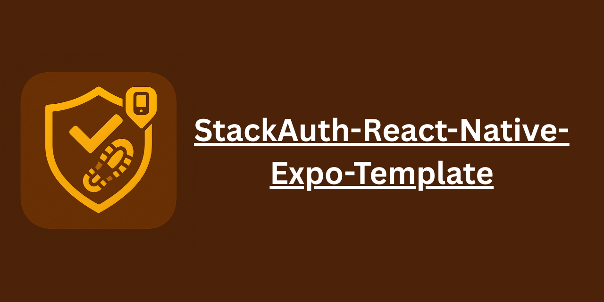
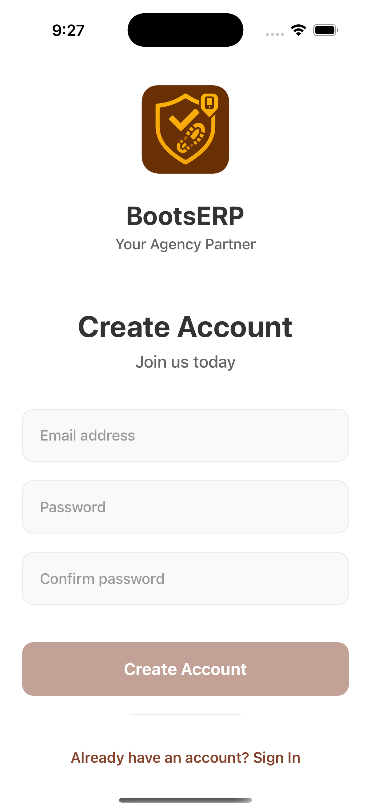
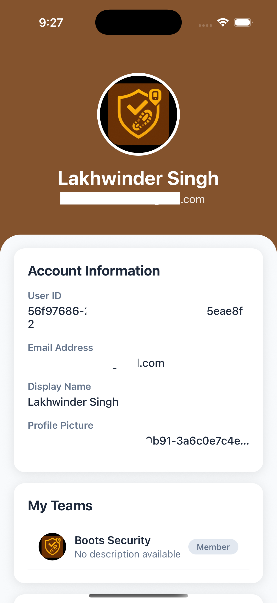
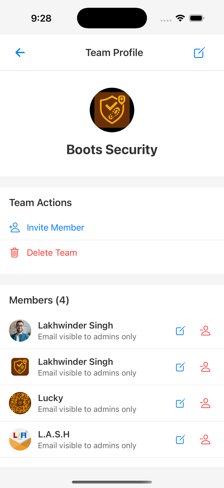

# StackAuth React Native Expo Template

<div align="center">
  
</div>

A complete React Native Expo template with StackAuth authentication integration for building mobile apps with secure user authentication on Android and iOS platforms.

## 🚀 Features

- **Complete Authentication System**: Login, signup, and user management
- **Team Management**: Create teams, invite members, manage team profiles
- **User Profiles**: Comprehensive user profile management with image upload
- **Cross-Platform**: Works on both Android and iOS
- **Modern UI**: Clean and responsive user interface
- **Environment Configuration**: Secure environment variable management

## 📱 Screenshots

<div align="center">
  
  
  
  
</div>

## 🛠️ Tech Stack

- **[React Native](https://reactnative.dev/)** - Cross-platform mobile development
- **[Expo](https://expo.dev/)** - Development platform and tools
- **[StackAuth](https://stack-auth.com/)** - Authentication and user management
- **[TypeScript](https://www.typescriptlang.org/)** - Type-safe JavaScript
- **[React Navigation](https://reactnavigation.org/)** - Navigation library
- **[Expo Router](https://docs.expo.dev/router/introduction/)** - File-based routing

## 🏁 Getting Started

### Prerequisites

- Node.js (v16 or higher)
- npm or yarn
- Expo CLI
- StackAuth account

### Installation

1. **Clone the repository**
   ```bash
   git clone https://github.com/bootssecurity/StackAuth-React-Native-Expo-Template.git
   cd StackAuth-React-Native-Expo-Template
   ```

2. **Install dependencies**
   ```bash
   npm install
   ```

3. **Set up environment variables**
   
   Create a `.env` file in the root directory and add your StackAuth configuration:
   
   ```env
   # StackAuth Configuration
   EXPO_PUBLIC_STACK_PROJECT_ID=your_project_id_here
   EXPO_PUBLIC_STACK_PUBLISHABLE_CLIENT_KEY=your_publishable_key_here
   STACK_SERVER_SECRET_KEY=your_server_secret_key_here
   EXPO_PUBLIC_STACK_BASE_URL=your_stack_base_url
   
   # Team Invitation Configuration
   EXPO_PUBLIC_TEAM_INVITATION_BASE_URL=https://yourinvitatitonbaseurl/handler/team-invitation/
   ```
   
   **How to get StackAuth credentials:**
   - Sign up at [StackAuth](https://stack-auth.com/)
   - Create a new project
   - Copy your project ID, publishable client key, and server secret key from the dashboard

4. **Start the development server**
   ```bash
   npm start
   ```
   
   This will start the Expo development server. You can then:
   - Press `i` to open iOS simulator
   - Press `a` to open Android emulator
   - Scan the QR code with Expo Go app on your physical device

## 📁 Project Structure

```
├── app/                    # App screens and navigation
│   ├── (tabs)/            # Tab-based screens
│   └── _layout.tsx        # Root layout
├── components/            # Reusable components
│   ├── LoginScreen.tsx    # Authentication screen
│   ├── UserProfile.tsx    # User profile management
│   ├── TeamProfile.tsx    # Team management
│   └── ui/               # UI components
├── lib/                   # Utilities and configurations
│   └── stack-auth.ts     # StackAuth configuration
├── contexts/             # React contexts
│   └── AuthContext.tsx   # Authentication context
├── constants/            # App constants
├── hooks/               # Custom hooks
└── assets/              # Images, fonts, etc.
```

## 🔧 Configuration

### StackAuth Setup

1. Create a StackAuth project at [stack-auth.com](https://stack-auth.com/)
2. Configure your project settings:
   - Set up allowed domains
   - Configure OAuth providers (optional)
   - Set up team features if needed
3. Update the `.env` file with your credentials

### Customization

- **Colors**: Modify `constants/Colors.ts` for theme colors
- **Components**: Customize UI components in the `components/` directory
- **Navigation**: Update navigation structure in `app/_layout.tsx`

## 📚 Key Features

### Authentication
- Email/password authentication
- Secure token management
- Protected routes

### User Management
- User profile creation and editing
- Profile image upload with compression
- Account settings

### Team Management
- Create and manage teams
- Invite team members via email
- Team member roles and permissions
- Team profile customization

## 🤝 Contributing

Contributions are welcome! Please feel free to submit a Pull Request.

### Contributors

- [bootssecurity](https://github.com/bootssecurity) - Project maintainer

## 🙏 Acknowledgments

This template is built on top of amazing open-source projects:

- **[Stack Auth](https://github.com/stack-auth/stack-auth)** - The open-source Auth0/Clerk alternative that powers our authentication system
- **[Expo](https://github.com/expo/expo)** - The open-source framework for making universal native apps with React

Special thanks to these projects and their maintainers for making modern mobile development accessible and powerful.

## 📄 License

This project is licensed under the MIT License.

## 🔗 Links

- [Repository](https://github.com/bootssecurity/StackAuth-React-Native-Expo-Template.git)
- [StackAuth Documentation](https://docs.stack-auth.com/)
- [Expo Documentation](https://docs.expo.dev/)
- [React Native Documentation](https://reactnative.dev/docs/getting-started)

## 🆘 Support

If you encounter any issues or have questions, please:
1. Check the [StackAuth documentation](https://docs.stack-auth.com/)
2. Open an issue on GitHub
3. Contact the maintainer at [bootssecurity](https://github.com/bootssecurity)

---

**Happy coding! 🎉**